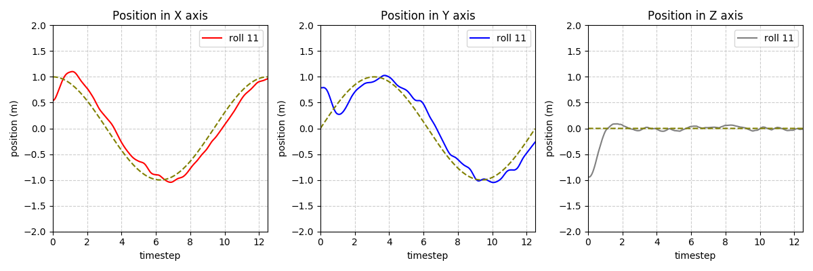
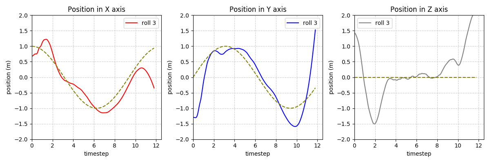
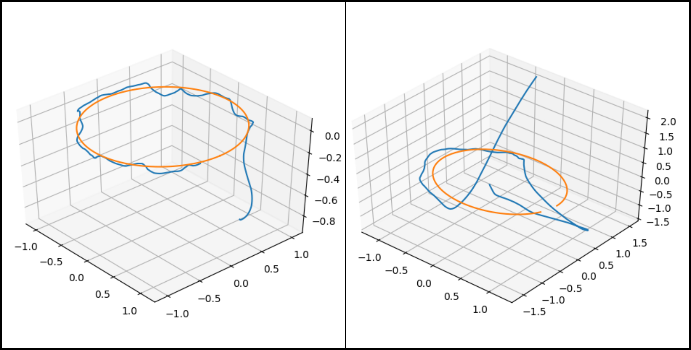
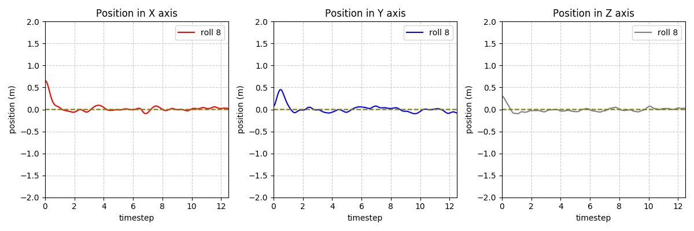
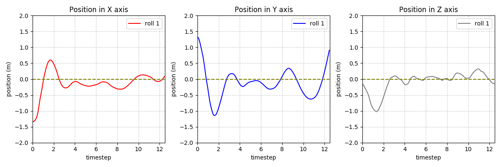
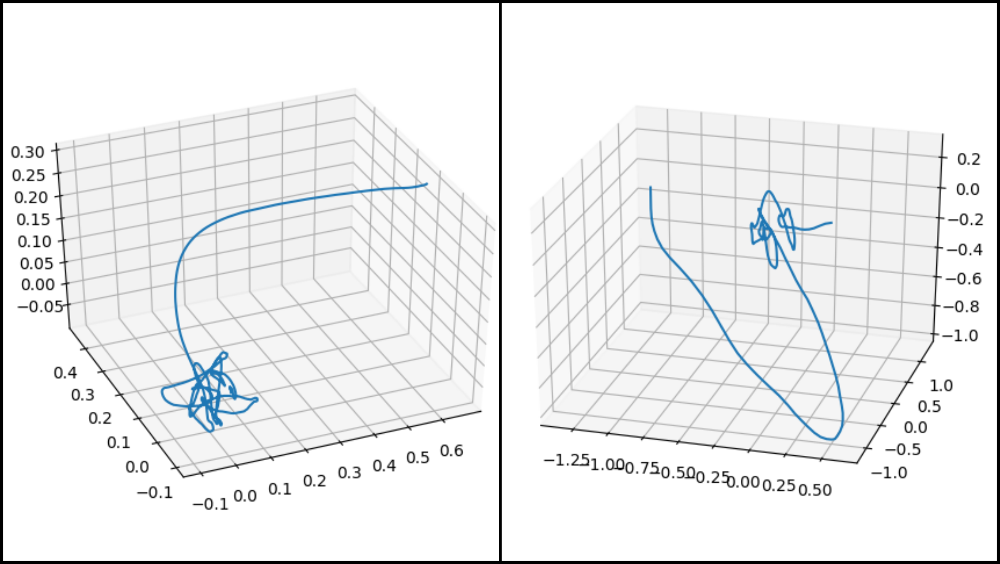

# Model-Based Reinforcement Learning for Quadrotor

Implementation of Quadrotor Model-based Learning in pytorch and VREP Simulator based of the following papers: 

[**Low-Level control of a quadrotor with deep model-based reinforcement learning**](https://ieeexplore.ieee.org/abstract/document/8769882)

[**Learning to adapt in dynamic, real-world environments through meta-reinforcement learning**](https://arxiv.org/abs/1803.11347)

# Current Progress
We are testing separately Fault-Free Case, and Fault-Motor 1 case for same trajectory.

#### Circle Trajectory
Here, we show trajectory followed by quadrotor in a *Circle* trajectory

**Fault-Free Case, trajectory over time**

**Fault-M1 Case, trajectory over time** 

**Same Comparison in 3D dim, Left Fault free, Right Fault Motor 1**

#### Point Trajectory

**Fault-Free Case, trajectory over time**

**Fault-M1 Case, trajectory over time** 

**Same Comparison in 3D dim, Left Fault free, Right Fault Motor 1**

